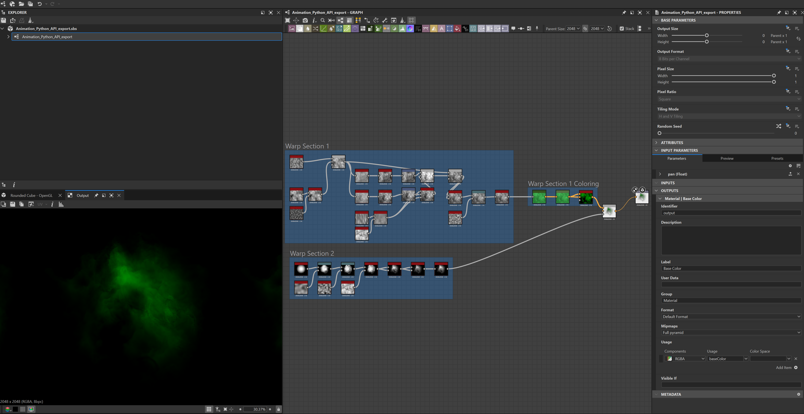

# Substance-Designer_Batch_Export_Animations
- This Python script batch exports animations from Substance Designer
- It uses the SD API to call specific nodes and automates the export of png files

# Animation

# Main Substance Designer Graph
